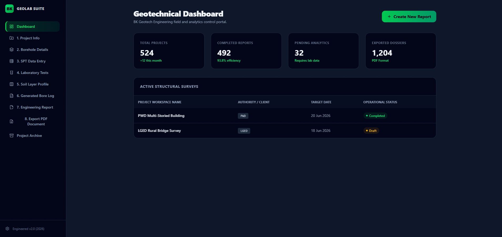
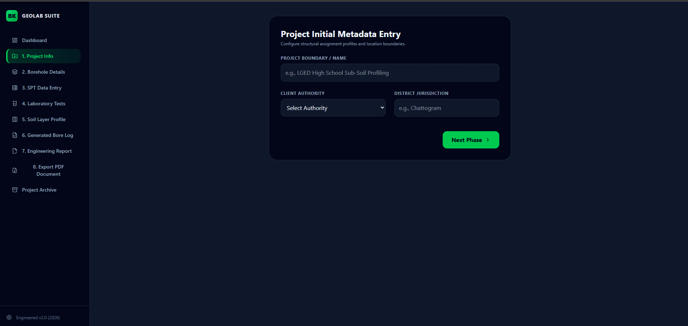
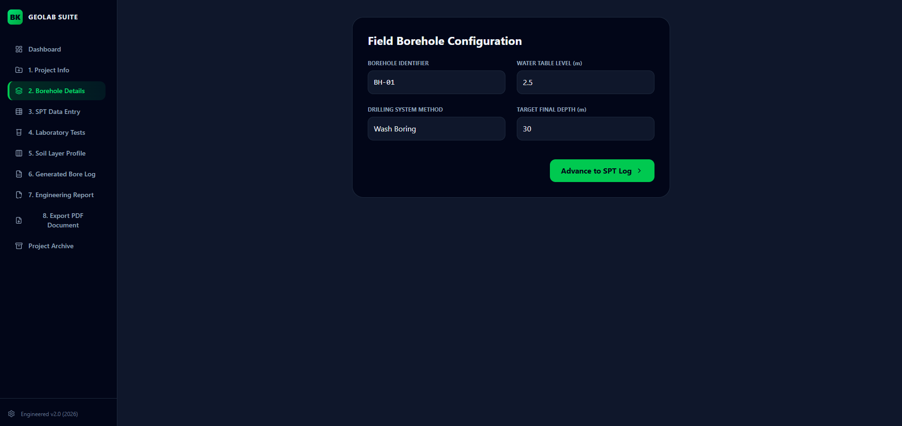

# Digital Soil Investigation Report Generator
### 🇧🇩 BK Geotech Engineering and Constructions — Academic Internship Project

An automated, data-driven engineering web application built during my tenure as an engineering intern at BK Geotech. This application streamlines the manual, error-prone workflow of analyzing geotechnical borehole metrics, computing Standard Penetration Test (SPT) values, and organizing laboratory soil classification data into standardized structural engineering dossiers for major government authorities like **LGED, PWD, HED, and BADC**.

## 🚀 Key Functional Modules
* **Geotechnical Analytics Control Center:** Interactive dashboard to monitor active structural surveys, timeline data patterns, and status vectors.
* **Sequential Field Data Input Wizard:** Streamlined parameters entry including location coordinates, water table configurations, and field execution tracking profiles.
* **Automated Mechanical Computations:** Integrated data logging matrix that dynamically computes SPT values on-the-fly using standard geotechnical penetration equations ($N = N_2 + N_3$).
* **Stratigraphic Cross-Section Generation:** A visual, color-coded soil profile matrix simulating underground soil horizon layering structures based on deep field boring data models.
* **Engineering Estimation Engine:** Pre-calculation structural mapping providing foundational typology suitabilities, allowable design pressures ($q_a$), and permissible elastic settlement tolerances.

## 🛠️ Project Architecture & Tech Stack
* **Frontend Library:** React (Vite environment deployment mapping)
* **Styling Engine:** Tailwind CSS + PostCSS configuration architecture
* **Icon Asset Library:** Lucide React engineering asset vectors

## 📸 Core Workspace Visuals
Here is a complete look at the live implementation workspace environments of the web platform:

### Geotechnical Dashboard Suite


### Automated Soil Layer Profile Stratigraphy


### Live Engineering Document Compiler


## 💻 Local Workspace Initial Setup
To execute this single-page production layout environment inside your local machine footprint, follow these terminal instructions:

```bash
# 1. Duplicate repository reference mapping profiles
git clone [https://github.com/YOUR_USERNAME/digital-soil-report-generator.git](https://github.com/YOUR_USERNAME/digital-soil-report-generator.git)

# 2. Enter project directory footprints
cd digital-soil-report-generator

# 3. Provision local dependency ecosystems
npm install

# 4. Spin up the modern hot-reloading development server
npm run dev